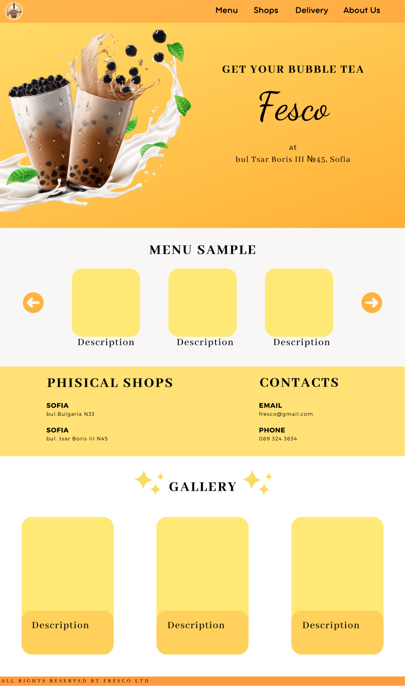

# Project website Fresco bubble tea

## Documentation

### Table of contents
- [Overview](#overvew)
- [Description](#description)
- [Goal](#goal)
- [Technology stack](#technology-stack)
- [Design & architectural decisions](#design-&-architectural-decisions)
- [Screenshots](#screenshots)
- [Technical documentation](#technical-documentation)

### Overview
For this project are build UI/UX decisions and full graphic package of materials including logo, images, packaging design and etc. The website is part which examines online presence of the project. Banners  made for ad purposes are other part of this online presence.

### Description
Creating active website for a bubble tea shop. For this job are used HTML & CSS for the appearance and JavaScript for the functionality.

### Goal
Creating active website for a bubble tea shop. This website should have functions and interactions with the users.

### Technology stack

- HTML
- CSS
- JavaScript

### Design & architectural decisions

### API documentation

### live demo

### Screenshots
~Till now~

